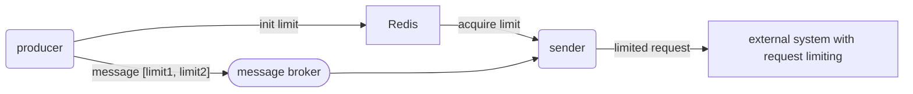

# Rapidity

[](https://rubygems.org/gems/rapidity)
[](https://rubygems.org/gems/rapidity/versions)
[](http://www.rubydoc.info/gems/rapidity)

[](https://lysander.rnds.pro/api/v1/badges/rapidity_coverage.html)
[](https://lysander.rnds.pro/api/v1/badges/rapidity_quality.html)
[](https://lysander.rnds.pro/api/v1/badges/rapidity_outdated.html)
[](https://lysander.rnds.pro/api/v1/badges/rapidity_vulnerable.html)

Simple but fast Redis-backed distributed rate limiter. Allows you to specify time interval and count within to limit distributed operations.

Features:

- extremly simple
- free from race condition through LUA scripting
- fast

[Article(russian) about gem.](https://blog.rnds.pro/029-rapidity/?utm_source=github&utm_medium=repo&utm_campaign=rnds)

## Usage

Rapidity has two variants:

- simple `Rapidity::Limiter` to handle single distibuted counter
- complex `Rapidity::Composer` to handle multiple counters at once

### Single conter with concurrent access

```ruby
pool = ConnectionPool.new(size: 10) do
  Redis.new(url: ENV.fetch('REDIS_URL', 'redis://127.0.0.1:6379'))
end

# allow no more 10 requests within 5 seconds
limiter = Rapidity::Limiter.new(pool, name: 'requests', threshold: 10, interval: 5)

loop do
  # try to obtain 3 requests at once
  quota = limiter.obtain(3).times do
    make_request
  end

  if quota == 0
    # no more requests allowed within interval
    sleep 1
  end
end

```

### Multiple counters

```ruby
pool = ConnectionPool.new(size: 10) do
  Redis.new(url: ENV.fetch('REDIS_URL', 'redis://127.0.0.1:6379'))
end

LIMITS = [
  { interval: 1, threshold: 2 },        # no more 2 requests per second
  { interval: 60, threshold: 200 },     # no more 200 requests per minute
  { interval: 86400, threshold: 10000 } # no more 10k requests per day
]

limiter = Rapidity::Composer.new(pool, name: 'requests', limits: LIMITS)

loop do
  # try to obtain 3 requests at once
  quota = limiter.obtain(3).times do
    make_request
  end

  if quota == 0
    # no more requests allowed within interval
    puts limiter.remains # inspect current limits
    sleep 1
  end
end
```

## Share module expansion
If your message producer and message sender are independent services, and you want the sender to be agnostic of the business rules for rate limiting, use the classes in the Share module. The producer is responsible for initializing and configuring the rate limits (e.g., token bucket) with the correct business parameters in Redis. The sender then only consumes these pre-defined limits without knowing the underlying rules.



### Base scenario

`Producer` ONLY creates limits, and send messages to the `Sender`. `Sender` actually use limits to achieve overall Rate Limiting. 

### Optinal **Feedback-Driven Flow Control** scenario

Beyond basic rate limiting, the Share module offers **optional queue management capabilities** that enable sophisticated **Feedback-Driven Flow Control**. This feature allows systems to handle temporary load spikes more gracefully while maintaining communication between producers and consumers.

In this scenario, `Producer` additionally checks the optional `max_queue` attribute in the limit to understand whether it makes sense to send requests to `Sender` or whether it is already loaded with previous requests. 
`Producer` MUST obtain semaphore `max_queue` on limites, then `Sender` MUST release semaphore `max_queue` after actual send request.

### Workflow with Code Examples
1. Initializing Limits and Optional Queues (Producer Side)
The message producer initializes rate limits with specific business rules. Queues can be added for handling traffic spikes.

```ruby
@pool = ConnectionPool.new(size: 5, timeout: 5) { Redis.new }
@producer = Rapidity::Share::Producer.new(@pool)
api_day_limit = Limit.new("day_limit", max_tokens: 1000, period: 86400, namespace: 'api_v2')
api_hour_limit = Limit.new("hour_limit", max_tokens: 100, period: 3600, max_queue: 100, namespace: 'api_v2')
@producer.init(api_day_limit)
@producer.init(api_hour_limit)
```
2. Each message is tagged with the limits it should consume when processed.
3. Messages flow through your message broker to the sender service.
4. The message sender attempts to acquire tokens before sending. If unavailable, it waits according to the token bucket algorithm.
```ruby
@pool = ConnectionPool.new(size: 5, timeout: 5) { Redis.new }
@sender = Rapidity::Share::Producer.new(@pool)
@sender.acquire(message['api_v2:day_limit', 'api_v2:hour_limit'], tokens: 1)
```
5. For queue-backed limits, senders can release tokens back to the queue to signal max_queue availability.

## Installation

It's a gem:

```bash
  gem install rapidity
```

There's also the wonders of [the Gemfile](http://bundler.io):

```ruby
  gem 'rapidity'
```

## Special Thanks

- [WeTransfer/prorate](https://github.com/WeTransfer/prorate) for LUA-examples
